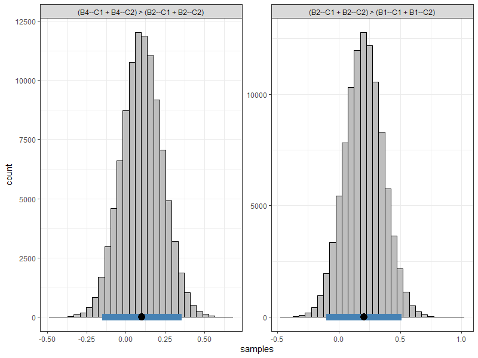

<!-- README.md is generated from README.Rmd. Please edit that file -->

```{r, include = FALSE}
knitr::opts_chunk$set(
  collapse = TRUE,
  comment = "#>",
  fig.path = "man/figures/README-",
  dev = "png",
  dpi = 200,
  fig.align = "center",
  fig.height = "70%",
  fig.width = "70%",
  knitr::opts_chunk$set(comment = NA)
  )
```

# bayeslincom
<!-- badges: start -->
 
[](https://travis-ci.org/josue-rodriguez/bayeslincom)
<!-- badges: end -->

The goal of **bayeslincom** is to provide point estimates, standard deviations, and credible intervals for linear combinations of posterior samples. Additionally, it allows for ROPE tests. 

## Installation

<!-- You can install the released version of bayeslincom from [CRAN](https://CRAN.R-project.org) with: -->

<!-- ``` r -->
<!-- install.packages("bayeslincom") -->
<!-- ``` -->

The development version from [GitHub](https://github.com/) with:

``` r
# install.packages("devtools")
devtools::install_github("josue-rodriguez/bayeslincom")
```
## How to use **bayeslincom**

 

```r
library(bayeslincom)
```
The main function is `lin_comb`. The following examples show how this function can be used to test linear combinations of posterior samples in tandem with different object types.

## Example: **BBcor**
The [**BBcor**](https://github.com/donaldRwilliams/BBcor) package provides Bayesian bootstrapped correlations and partial correlations. In the following, the test is whether the magnitude of one correlation is larger than that for a sum of two correlations. The correlations can be estimated with

```r
library(BBcor)

# data
Y <- mtcars[, c("mpg", "wt", "hp")]

# fit model
fit_bb <- bbcor(Y, method = "spearman")

# print
fit_bb

#>           mpg         wt         hp
#> mpg  1.0000000 -0.8842590 -0.8946683
#> wt  -0.8842590  1.0000000  0.7754185
#> hp  -0.8946683  0.7754185  1.0000000
```

Next the hypothesis is written out. In this case

```r
hyp <- "-1*mpg--wt - (-1*mpg--hp + wt--hp) = 0"
```

Note that each relation is multiplied by the sign. This ensures the magnitude is being compared. Next the hypothesis is tested using the `lin_comb` function

```r
lin_comb(hyp, 
         obj = fit_bb, 
         cri_level = 0.95)

#> bayeslincom: Linear Combinations of Posterior Samples
#> ------ 
#> Call:
#> lin_comb.bbcor(lin_comb = lin_comb, obj = obj, cri_level = cri_level, 
#>     rope = rope)
#> ------ 
#> Combinations:
#>  C1: -1*mpg--wt - (-1*mpg--hp + wt--hp) = 0 
#> ------ 
#> Posterior Summary:
#>
#>    Post.mean Post.sd Cred.lb Cred.ub Pr.less Pr.greater
#> C1     -0.78   -0.78   -0.92   -0.59       1          0
#> ------ 
#> Note:
#> Pr.less: Posterior probability less than zero
#> Pr.greater: Posterior probability greater than zero
```

In this case, the sum of the relations, `mpg--hp` and `wt--hp`, are larger than the relation `mpg--wt`, with a posterior probability of 1. 

This example also demonstrates a key contribution of **bayeslincom**, i.e., testing linear combinations among dependent correlations. This is the only Bayesian (and possibly in general) implementation in `R`.

## Example: **Multiple Combinations**
The [**BGGM**](https://github.com/donaldRwilliams/BGGM) [@williamsBayesian2019; @williamsComparing2020] package provides tools for Bayesian estimation and hypothesis testing within Gaussian graphical models (i.e., partial correlation networks). This package is particularly useful as it estimates the posterior distribution for a network made up of ordinal, binary, or mixed data. 

```r
library(BGGM)

# data (+ 1)
Y <- ptsd[, 1:7] + 1

# BGGM estimate
fit_bggm <- estimate(Y, type = "ordinal", iter = 100000)

# example hypotheses
hyps <- c("(B4--C1 + B4--C2) > (B2--C1 + B2--C2)",
          "(B2--C1 + B2--C2) > (B1--C1 + B1--C2)")

# test
test <- lin_comb(hyps,
                 fit_bggm,
                 cri_level = 0.95)
test

#> bayeslincom: Linear Combinations of Posterior Samples
#> ------ 
#> Call:
#> lin_comb.BGGM(lin_comb = lin_comb, obj = obj, cri_level = cri_level, 
#>     rope = rope)
#> ------ 
#> Combinations:
#>  C1: (B4--C1 + B4--C2) > (B2--C1 + B2--C2) 
#>  C2: (B2--C1 + B2--C2) > (B1--C1 + B1--C2) 
#> ------ 
#> Posterior Summary:
#>
#>    Post.mean Post.sd Cred.lb Cred.ub Pr.less Pr.greater
#> C1       0.1     0.1   -0.15    0.36    0.22       0.78
#> C2       0.2     0.2   -0.10    0.51    0.10       0.90
#> ------ 
#> Note:
#> Pr.less: Posterior probability less than zero
#> Pr.greater: Posterior probability greater than zero
```
```r
plot(test) +
  ggplot2::theme_bw()
```



## Example: Data Frame
### **MCMCpack**
There are a variety of `R` packages that provide samples from the 
posterior distribution. By placing the respective samples into 
a `data.frame`, **bayeslincom** can be used to test linear combinations. 
Here is an example using **MCMCpack**.

```r
library(MCMCpack)

# data 
Y <- mtcars

# fit model
fit_mcmc <- MCMCpack::MCMCregress(mpg ~ vs + hp, 
                                   data = Y, 
                                   mcmc = 100000)
                                   
# data frame
samps <- as.data.frame(fit_mcmc)
                                   
# test hypothesis
test <- lin_comb(lin_comb = "vs - hp = 0", 
                 obj = samps, 
                 cri_level = 0.95)                                 

# print results
fit_bayes

#> bayeslincom: Linear Combinations of Posterior Samples
#> ------ 
#> Call:
#> lin_comb.data.frame(lin_comb = lin_comb, obj = obj, cri_level = cri_level, 
#>     rope = rope)
#> ------ 
#> Combinations:
#>  C1: vs - hp = 0 
#> ------ 
#> Posterior Summary:
#>
#>    Post.mean Post.sd Cred.lb Cred.ub Pr.less Pr.greater
#> C1      2.64    2.64   -1.38    6.65    0.09       0.91
#> ------ 
#> Note:
#> Pr.less: Posterior probability less than zero
#> Pr.greater: Posterior probability greater than zero
```

Note that the hypothesis could also be written as `vs = hp`.

#### Comparison to **multcomp**

The above can also be implemented with the `R` package **multcomp**.

```r
library(multcomp)

# fit model
fit_lm <- lm(mpg ~ vs + hp, 
             data = Y) 

# confidence interval
confint(
  multcomp::glht(fit_lm, linfct = "vs - hp == 0"), 
  level = 0.95
  )

#> 	 Simultaneous Confidence Intervals
#> 
#> Fit: lm(formula = mpg ~ vs + hp, data = Y)
#> 
#> Quantile = 2.0452
#> 95% family-wise confidence level
 

#> Linear Hypotheses:
#>              Estimate lwr     upr    
#> vs - hp == 0  2.6308  -1.3763  6.6378
```

Although the results are nearly identical, note that **bayeslincom**  (1) provides the posterior probability of a positive and negative difference; and (2) is compatible with essentially all `R`packages for Bayesian analysis.

## Example: **ROPE**
Testing against a null value can be done using a ROPE (region of practical equivalence) [@rouderBayesian2018; @kruschkeBayesian2018].


```r
library(rstanarm)

# data
Y <- kidiq

# fit model
fit_rstan <- stan_glm(kid_score ~ mom_iq + mom_age, 
                      data = Y, 
                      family = gaussian,
                      iter = 50000)

# data frame
samps <- as.data.frame(fit_rstan)

# test ROPE
rope <- lin_comb("mom_iq - mom_age = 0",
                  obj = samps,
                  cri_level = 0.95,
                  rope = c(-1, 1))

rope

#> bayeslincom: Linear Combinations of Posterior Samples
#> ------ 
#> Call:
#> lin_comb.data.frame(lin_comb = lin_comb, obj = obj, cri_level = cri_level, 
#>     rope = rope)
#> ------ 
#> Combinations:
#>  C1: mom_iq - mom_age = 0 
#> ------ 
#> Posterior Summary:
#> 
#> ROPE: [ -1 , 1 ] 
#> 
#>    Post.mean Post.sd Cred.lb Cred.ub   Pr.in
#> C1      0.22    0.22   -0.44    0.88 0.98983
#> ------ 
#> Note:
#> Pr.in: Posterior probability in ROPE
```
```r
plot(rope) +
  ggplot2::theme_bw()
```


## References

