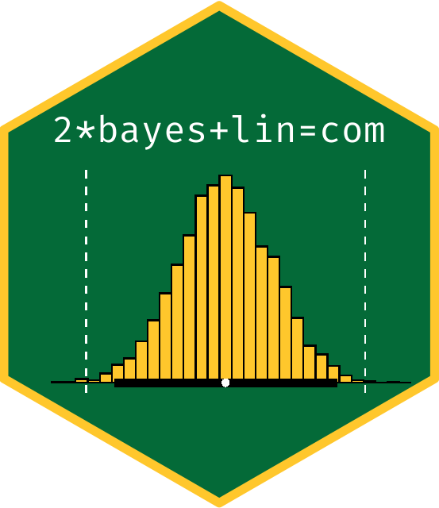
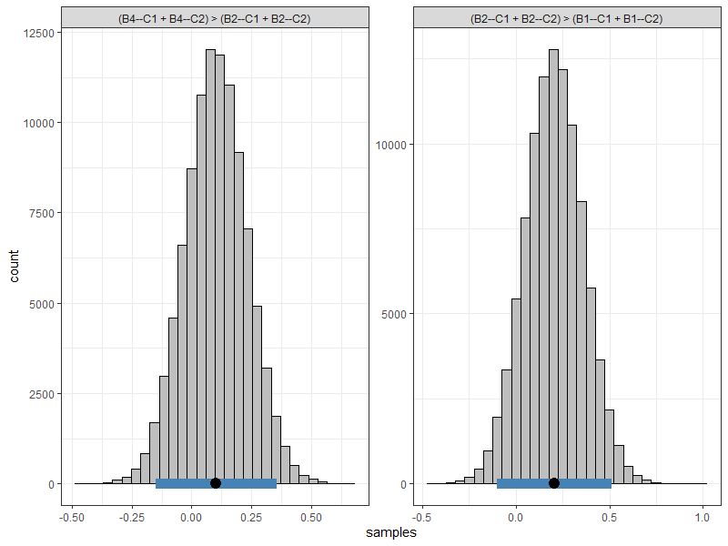
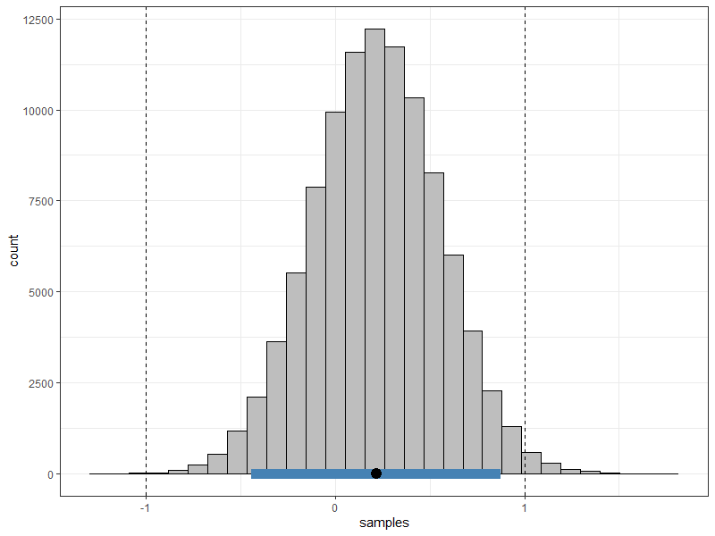

<!-- README.md is generated from README.Rmd. Please edit that file -->

# bayeslincom

<!-- hex sticker -->



<!-- badges: start -->

 [](https://travis-ci.org/josue-rodriguez/bayeslincom)
<!-- badges: end -->

The goal of **bayeslincom** is to provide point estimates, standard
deviations, and credible intervals for linear combinations of posterior
samples. Additionally, it allows for ROPE tests.

## Installation

<!-- You can install the released version of bayeslincom from [CRAN](https://CRAN.R-project.org) with: -->

<!-- ``` r -->

<!-- install.packages("bayeslincom") -->

<!-- ``` -->

The development version from [GitHub](https://github.com/) with:

``` r
# install.packages("devtools")
devtools::install_github("josue-rodriguez/bayeslincom")
```

## How to use **bayeslincom**

``` r
library(bayeslincom)
```

The main function is `lin_comb`. The following examples show how this
function can be used to test linear combinations of posterior samples in
tandem with different object types.

## Example: **BBcor**

The [**BBcor**](https://github.com/donaldRwilliams/BBcor) package
provides Bayesian bootstrapped correlations and partial correlations. In
the following, the test is whether the magnitude of one correlation is
larger than that for a sum of two correlations. The correlations can be
estimated with

``` r
library(BBcor)

# data
Y <- mtcars[, c("mpg", "wt", "hp")]

# fit model
fit_bb <- bbcor(Y, method = "spearman")

# print
fit_bb

#>           mpg         wt         hp
#> mpg  1.0000000 -0.8842590 -0.8946683
#> wt  -0.8842590  1.0000000  0.7754185
#> hp  -0.8946683  0.7754185  1.0000000
```

Next the hypothesis is written out. In this case

``` r
hyp <- "-1*mpg--wt - (-1*mpg--hp + wt--hp) = 0"
```

Note that each relation is multiplied by the sign. This ensures the
magnitude is being compared. Next the hypothesis is tested using the
`lin_comb` function

``` r
lin_comb(hyp, 
         obj = fit_bb, 
         cri_level = 0.95)

#> bayeslincom: Linear Combinations of Posterior Samples
#> ------ 
#> Call:
#> lin_comb.bbcor(lin_comb = lin_comb, obj = obj, cri_level = cri_level, 
#>     rope = rope)
#> ------ 
#> Combinations:
#>  C1: -1*mpg--wt - (-1*mpg--hp + wt--hp) = 0 
#> ------ 
#> Posterior Summary:
#>
#>    Post.mean Post.sd Cred.lb Cred.ub Pr.less Pr.greater
#> C1     -0.78   -0.78   -0.92   -0.59       1          0
#> ------ 
#> Note:
#> Pr.less: Posterior probability less than zero
#> Pr.greater: Posterior probability greater than zero
```

In this case, the sum of the relations, `mpg--hp` and `wt--hp`, are
larger than the relation `mpg--wt`, with a posterior probability of 1.

This example also demonstrates a key contribution of **bayeslincom**,
i.e., testing linear combinations among dependent correlations. This is
the only Bayesian (and possibly in general) implementation in `R`.

## Example: **Multiple Combinations**

The [**BGGM**](https://github.com/donaldRwilliams/BGGM) package
(Williams and Mulder 2019; Williams et al. 2020) provides tools for
Bayesian estimation and hypothesis testing within Gaussian graphical
models (i.e., partial correlation networks). This package is
particularly useful as it estimates the posterior distribution for a
partial correlations based on ordinal (polychoric), binary
(tetrachoric), or mixed data.

An ordinal network can be estimated with

``` r
library(BGGM)

# data (+ 1)
Y <- ptsd[, 1:7] + 1

# BGGM estimate
fit_bggm <- estimate(Y, type = "ordinal", iter = 100000)
```

Note that 1 is added to the data in order to ensure the first category
is 1 when `type = "ordinal"`.

Several combinations can then be formulated and then passed on to
`lin_comb`. This can be done by placing strings of combinations into a
vector as shown below.

``` r
# example combinations
hyps <- c("(B4--C1 + B4--C2) > (B2--C1 + B2--C2)",
          "(B2--C1 + B2--C2) > (B1--C1 + B1--C2)")

# test
test <- lin_comb(hyps,
                 fit_bggm,
                 cri_level = 0.95)
test

#> bayeslincom: Linear Combinations of Posterior Samples
#> ------ 
#> Call:
#> lin_comb.BGGM(lin_comb = lin_comb, obj = obj, cri_level = cri_level, 
#>     rope = rope)
#> ------ 
#> Combinations:
#>  C1: (B4--C1 + B4--C2) > (B2--C1 + B2--C2) 
#>  C2: (B2--C1 + B2--C2) > (B1--C1 + B1--C2) 
#> ------ 
#> Posterior Summary:
#>
#>    Post.mean Post.sd Cred.lb Cred.ub Pr.less Pr.greater
#> C1       0.1     0.1   -0.15    0.36    0.22       0.78
#> C2       0.2     0.2   -0.10    0.51    0.10       0.90
#> ------ 
#> Note:
#> Pr.less: Posterior probability less than zero
#> Pr.greater: Posterior probability greater than zero
```

The first combination tests whether the PTSD symptom “emotional
reactivity” (B4) has a stronger relationship than the symptom
“nightmares” (B2) with the cluster of nodes representing “avoidance”
(C1 and C2). The second combination tests the same, except for testing
for “nightmares” and “intrusive thoughts” (B1).

In addition to being the only implementation in `R` for testing linear
combinations of (partial) correlations it is also the only
implementation for testing linear combinations of polychoric and
tetrachoric correlations (due to the **BGGM** sampling algorithms).

Objects created with `lin_comb` also have a `plot` method which returns
a **ggplot2** object that can further be customized, e.g.

``` r
plot(test) +
  ggplot2::theme_bw()
```



## Example: Data Frame

There are a variety of `R` packages that provide samples from the
posterior distribution. By placing the respective samples into a
`data.frame`, **bayeslincom** can be used to test linear combinations.
Here is an example using **MCMCpack**.

``` r
library(MCMCpack)

# data 
Y <- mtcars

# fit model
fit_mcmc <- MCMCregress(mpg ~ vs + hp, 
                        data = Y, 
                        mcmc = 100000)
                                   
# data frame
samps <- as.data.frame(fit_mcmc)
                                   
# test hypothesis
test <- lin_comb(lin_comb = "vs - hp = 0", 
                 obj = samps, 
                 cri_level = 0.95)                                 

# print results
fit_bayes

#> bayeslincom: Linear Combinations of Posterior Samples
#> ------ 
#> Call:
#> lin_comb.data.frame(lin_comb = lin_comb, obj = obj, cri_level = cri_level, 
#>     rope = rope)
#> ------ 
#> Combinations:
#>  C1: vs - hp = 0 
#> ------ 
#> Posterior Summary:
#>
#>    Post.mean Post.sd Cred.lb Cred.ub Pr.less Pr.greater
#> C1      2.64    2.64   -1.38    6.65    0.09       0.91
#> ------ 
#> Note:
#> Pr.less: Posterior probability less than zero
#> Pr.greater: Posterior probability greater than zero
```

Note that the hypothesis could also be written as `vs = hp`.

#### Comparison to **multcomp**

The above can also be implemented with the `R` package **multcomp**.

``` r
library(multcomp)

# fit model
fit_lm <- lm(mpg ~ vs + hp, 
             data = Y) 

# confidence interval
confint(
  multcomp::glht(fit_lm, linfct = "vs - hp == 0"), 
  level = 0.95
  )

#>   Simultaneous Confidence Intervals
#> 
#> Fit: lm(formula = mpg ~ vs + hp, data = Y)
#> 
#> Quantile = 2.0452
#> 95% family-wise confidence level
 

#> Linear Hypotheses:
#>              Estimate lwr     upr    
#> vs - hp == 0  2.6308  -1.3763  6.6378
```

Although the results are nearly identical, note that **bayeslincom** (1)
provides the posterior probability of a positive and negative
difference; and (2) is compatible with essentially all `R`packages for
Bayesian analysis.

## Example: **ROPE**

Testing against a null value can be done using a region of practical
equivalence (ROPE) (Rouder, Haaf, and Vandekerckhove 2018; Kruschke and
Liddell 2018). The ROPE approach is similar in spirit to a frequentist
approach wherein a parameter value is rejected if it is not covered by a
confidence interval at a particular level. The difference with the ROPE
is that the null value is only rejected if there is no overlap between
the credible interval and the ROPE. Conversely, the null value is only
accepted if the entire credible interval is inside the ROPE\>

In the following example, a model is fit using
[**rstanarm**](https://github.com/stan-dev/rstanarm). The difference
between the coefficients for `mom_iq` an `mom_age` is tested against a
null value of zero with a ROPE corresponding to \[-1, 1\]

``` r
library(rstanarm)

# data
Y <- kidiq

# fit model
fit_rstan <- stan_glm(kid_score ~ mom_iq + mom_age, 
                      data = Y, 
                      family = gaussian,
                      iter = 50000)

# data frame
samps <- as.data.frame(fit_rstan)

# test ROPE
rope <- lin_comb("mom_iq - mom_age = 0",
                  obj = samps,
                  cri_level = 0.95,
                  rope = c(-1, 1))

rope

#> bayeslincom: Linear Combinations of Posterior Samples
#> ------ 
#> Call:
#> lin_comb.data.frame(lin_comb = lin_comb, obj = obj, cri_level = cri_level, 
#>     rope = rope)
#> ------ 
#> Combinations:
#>  C1: mom_iq - mom_age = 0 
#> ------ 
#> Posterior Summary:
#> 
#> ROPE: [ -1 , 1 ] 
#> 
#>    Post.mean Post.sd Cred.lb Cred.ub   Pr.in
#> C1      0.22    0.22   -0.44    0.88 0.98983
#> ------ 
#> Note:
#> Pr.in: Posterior probability in ROPE
```

``` r
plot(rope) +
  ggplot2::theme_bw()
```



## References

<div id="refs" class="references">

<div id="ref-kruschkeBayesian2018">

Kruschke, John K., and Torrin M. Liddell. 2018. “The Bayesian New
Statistics: Hypothesis Testing, Estimation, Meta-Analysis, and Power
Analysis from a Bayesian Perspective.” *Psychonomic Bulletin & Review*
25 (1): 178–206. <https://doi.org/10.3758/s13423-016-1221-4>.

</div>

<div id="ref-rouderBayesian2018">

Rouder, Jeffrey N., Julia M. Haaf, and Joachim Vandekerckhove. 2018.
“Bayesian Inference for Psychology, Part IV: Parameter Estimation and
Bayes Factors.” *Psychonomic Bulletin & Review* 25 (1): 102–13.
<https://doi.org/10.3758/s13423-017-1420-7>.

</div>

<div id="ref-williamsBayesian2019">

Williams, Donald Ray, and Joris Mulder. 2019. “Bayesian Hypothesis
Testing for Gaussian Graphical Models: Conditional Independence and
Order Constraints.” Preprint. PsyArXiv.
<https://doi.org/10.31234/osf.io/ypxd8>.

</div>

<div id="ref-williamsComparing2020">

Williams, Donald R., Philippe Rast, Luis R. Pericchi, and Joris Mulder.
2020. “Comparing Gaussian Graphical Models with the Posterior Predictive
Distribution and Bayesian Model Selection.” *Psychological Methods*.
<https://doi.org/10.1037/met0000254>.

</div>

</div>
