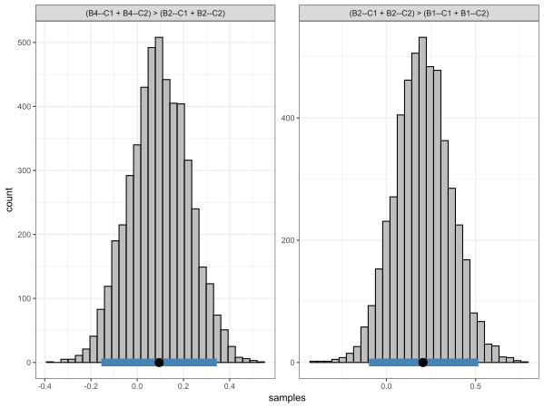

<!-- README.md is generated from README.Rmd. Please edit that file -->

# bayeslincom

<!-- badges: start -->

 [](https://travis-ci.org/josue-rodriguez/bayeslincom)
<!-- badges: end -->

The goal of `bayeslincom` is to provide point estimates, standard
deviations, and credible intervals for linear combinations of posterior
samples. Additionally, it allows for ROPE tests

## Installation

<!-- You can install the released version of bayeslincom from [CRAN](https://CRAN.R-project.org) with: -->

<!-- ``` r -->

<!-- install.packages("bayeslincom") -->

<!-- ``` -->

The development version from [GitHub](https://github.com/) with:

``` r
# install.packages("devtools")
devtools::install_github("josue-rodriguez/bayeslincom")
```

Some basic examples for solving a common problems with the `R` package
**bayeslincom**:

## Example: **BBcor**

The **BBcor** package provides Bayesian bootstrapped correlations and
partial correlations. In the following, the test is whether one
correlation is larger than the sum of two correlations. The correlations
can be estimated with

``` r
library(BBcor)

# data
Y <- mtcars[, c("mpg", "wt", "hp")]

# fit model
fit <- bbcor(Y, method = "spearman")

# print
fit

#>           mpg         wt         hp
#> mpg  1.0000000 -0.8842590 -0.8946683
#> wt  -0.8842590  1.0000000  0.7754185
#> hp  -0.8946683  0.7754185  1.0000000
```

Next the hypothesis is written out. In this case

``` r
hyp <- "-1*mpg--wt - (-1*mpg--hp + wt--hp) = 0"
```

Note that each relation is multiplied by the sign. This ensures the
magnitude is being compared. Next the hypothesis is tested using the
`lin_comb` function

``` r
library(bayeslincom)

lin_comb(hyp, 
         obj = fit, 
         cri_level = 0.95)

#> bayeslincom: Linear Combinations of Posterior Samples
#> ------ 
#> Call:
#> lin_comb.bbcor(lin_comb = lin_comb, obj = obj, cri_level = cri_level, 
#>     rope = rope)
#> ------ 
#> Combinations:
#>  C1: -1*mpg--wt - (-1*mpg--hp + wt--hp) = 0 
#> ------ 
#> Posterior Summary:
#>
#>    Post.mean Post.sd Cred.lb Cred.ub Pr.less Pr.greater
#> C1     -0.78   -0.78   -0.92   -0.59       1          0
#> ------ 
#> Note:
#> Pr.less: Posterior probability less than zero
#> Pr.greater: Posterior probability greater than zero
```

In this case, the sum of the relations, `mpg--hp` and `wt--hp`, are
larger than the relation `mpg--wt`, with a posterior probability of 1.

This example also demonstrates a key contribution of **bayeslincom**,
i.e., testing linear combinations among dependent correlations. This is
the only Bayesian (and possibly in general) implementation in `R`.

## Example: Data Frame

### **MCMCpack**

There are a variety of `R` packages that provide samples from the
posterior distribution. By placing the respective samples into a
`data.frame`, **bayeslincom** can be used to test linear combinations.
Here is an example using **MCMCpack**.

``` r
library(MCMCpack)

# data 
Y <- mtcars

# fit model
fit_bayes <- MCMCpack::MCMCregress(mpg ~ vs + hp, 
                                   data = Y, 
                                   mcmc = 100000)
                                   
# data frame
samps <- as.data.frame(fit_bayes)
                                   
# test hypothesis
test <- lin_comb(lin_comb = "vs - hp = 0", 
                 obj  = samps, 
                 cri_level = 0.95)                                 

# print results
fit_bayes

#> bayeslincom: Linear Combinations of Posterior Samples
#> ------ 
#> Call:
#> lin_comb.data.frame(lin_comb = lin_comb, obj = obj, cri_level = cri_level, 
#>     rope = rope)
#> ------ 
#> Combinations:
#>  C1: vs - hp = 0 
#> ------ 
#> Posterior Summary:
#>
#>    Post.mean Post.sd Cred.lb Cred.ub Pr.less Pr.greater
#> C1      2.64    2.64   -1.38    6.65    0.09       0.91
#> ------ 
#> Note:
#> Pr.less: Posterior probability less than zero
#> Pr.greater: Posterior probability greater than zero
```

Note that the hypothesis could also be written as `vs = hp`.

## Example: **Multiple Combinations**

``` r
library(BGGM)

# data (+ 1)
Y <- ptsd[, 1:7] + 1
head(Y)

# BGGM estimate
est <- estimate(Y, type = "ordinal")

# example hypotheses
hyps <- c("(B4--C1 + B4--C2) > (B2--C1 + B2--C2)",
          "(B2--C1 + B2--C2) > (B1--C1 + B1--C2)")
         
# test
test <- lin_comb(hyps,
                 est,
                 cri_level = 0.95)
test

#> bayeslincom: Linear Combinations of Posterior Samples
#> ------ 
#> Call:
#> lin_comb.BGGM(lin_comb = lin_comb, obj = obj, cri_level = cri_level, 
#>     rope = rope)
#> ------ 
#> Combinations:
#>  C1: (B4--C1 + B4--C2) > (B2--C1 + B2--C2) 
#>  C2: (B2--C1 + B2--C2) > (B1--C1 + B1--C2) 
#> ------ 
#> Posterior Summary:
#> 
#>    Post.mean Post.sd Cred.lb Cred.ub Pr.less Pr.greater
#> C1      0.10    0.10   -0.16    0.34    0.23       0.77
#> C2      0.21    0.21   -0.10    0.52    0.09       0.91
#> ------ 
#> Note:
#> Pr.less: Posterior probability less than zero
#> Pr.greater: Posterior probability greater than zero
```

``` r
plot(test) +
  ggplot2::theme_bw()
```



## Example: **ROPE**

#### Comparison to **multcomp**

The above can also be implemented with the `R` package **multcomp**.

``` r
library(multcomp)

# fit model
fit_lm <- lm(mpg ~ vs + hp, 
             data = Y) 

# confidence interval
confint(
  multcomp::glht(fit_lm, linfct = "vs - hp == 0"), 
  level = 0.95
  )

#>   Simultaneous Confidence Intervals
#> 
#> Fit: lm(formula = mpg ~ vs + hp, data = Y)
#> 
#> Quantile = 2.0452
#> 95% family-wise confidence level
 

#> Linear Hypotheses:
#>              Estimate lwr     upr    
#> vs - hp == 0  2.6308  -1.3763  6.6378
```

Although the results are nearly identical, note that **bayeslincom** (1)
provides the posterior probability of a positive and negative
difference; and (2) is compatible with essentially all `R`packages for
Bayesian analysis.
